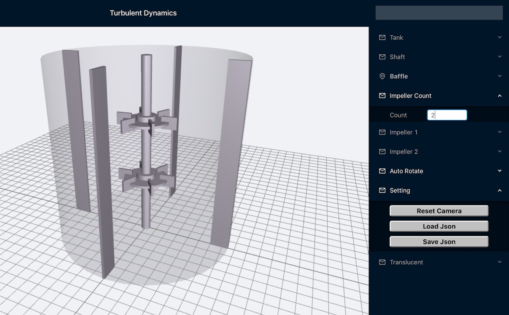

# Turbulent Dynamics Geometry Input Rushton Turbine
Create the input json file for a simple Rushton Turbine

[Graphical Frontend Available Here.](https://turbulentdynamics.github.io/tdGeometry_Rushton_Turbine_WebGL/build/)


## Rushton Turbine Image



# Graphical User Input

### Install nodejs and npm.  [See spack installation](https://github.com/TurbulentDynamics/TD_env_setup_dev_info/blob/master/env_setup/install_1_with_spack.md)
```
spack install node-js npm
```

### Install app dependencies and build
```
npm install
npm run-script build
```

### Runs the app in the development mode.
`npm start`
Open [http://localhost:3000](http://localhost:3000) to view it in the browser.

